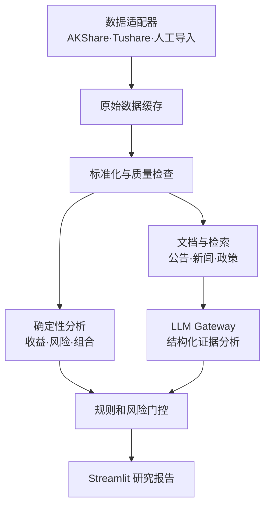

# 个人基金研究辅助系统

> 项目代号：`fund-research-assistant`  
> 当前状态：v0.1.0 可运行原型  
> 运行方式：Windows 本地、单用户、私有数据不上传

## 1. 项目定位

这是一个面向中国公募基金和个人支付宝持仓的本地研究辅助系统。

它的目标不是预测涨跌或自动推荐基金，而是把分散的数据、风险指标、基金资料和个人持仓整理成一份可以核验、可以追溯的研究报告，帮助回答：

1. 这只基金属于什么类型，应该用什么方法评价？
2. 它过去的收益来自哪里，承担了多大风险？
3. 与基准及同类相比，表现是否具有持续性？
4. 数据和持仓披露是否足够新、足够完整？
5. 它加入当前组合后，会不会造成行业或风险过度集中？
6. 当前更接近“数据不足、继续观察、再平衡候选”中的哪一种状态？

系统只提供研究与风险辅助，不自动登录支付宝、不连接交易接口、不自动下单，也不保证历史规律在未来继续有效。

## 快速开始

Windows PowerShell：

```powershell
git clone https://github.com/JadeeJacson/fund-research-assistant.git
cd fund-research-assistant

py -3.12 -m venv .venv
.venv\Scripts\activate
python -m pip install --upgrade pip
pip install -e ".[dev]"

Copy-Item .env.example .env
fundlab init-db
streamlit run app.py
```

浏览器通常会自动打开 `http://localhost:8501`。如果暂时不配置 DeepSeek，系统会使用 Mock Provider，基金指标和数据库功能仍可运行。

启用 DeepSeek：

1. 打开项目根目录的 `.env`；
2. 设置 `FUNDLAB_AI_ENABLED=true`；
3. 填写 `DEEPSEEK_API_KEY`；
4. 保持默认 `DEEPSEEK_MODEL=deepseek-v4-flash`，或按官方最新文档修改；
5. 运行 `fundlab ai-check` 检查配置；
6. 在 Streamlit 的“AI 证据”页面录入带来源和发布时间的公开材料后再运行分析。

完整操作见 [DeepSeek 配置](docs/DEEPSEEK_SETUP.md)、[数据导入](docs/DATA_IMPORT.md)和[开发说明](docs/DEVELOPMENT.md)。

## 2. 用户约束

当前设计基于以下使用条件：

- 主要研究支付宝中可购买的中国公募基金；
- 典型持有期约 1～2 年；
- 对账户阶段性亏损较敏感，整体回撤容忍区间约为 5%～10%；
- 希望兼顾收益、风险、估值、持仓变化、新闻和组合适配；
- 第一阶段优先免费、本地、可解释和易维护；
- 从第一版架构开始保留大模型 API、证据和调用审计接口，实际能力按里程碑启用；
- 使用 Windows 和 Python 3.12；
- 源代码放在私有 GitHub 仓库，真实持仓和密钥只保存在本地。

## 3. 核心设计原则

### 3.1 计算与解释分离

- Python 负责收益、回撤、波动率、相关性和组合风险等确定性计算；
- 规则引擎负责风险否决、数据质量判断和状态分类；
- AI 通过独立 Gateway 负责解释公告、新闻和结构化证据；
- 大模型不得自行生成核心数字，也不得绕过风险规则输出买卖结论。
- 即使尚未配置真实 API Key，也使用 Mock Provider 验证完整 AI 数据链路，避免后续改造核心模块。

### 3.2 数据可追溯

每条外部数据至少保存：

- 数据来源；
- 对应日期或报告期；
- 实际披露时间；
- 本地获取时间；
- 原始值与标准化值；
- 数据质量状态。

### 3.3 基金分类后再评价

以下产品不能共用一套评分公式：

- 宽基指数基金和 ETF；
- 行业、主题指数基金；
- 主动权益基金；
- 债券基金；
- 货币基金；
- QDII；
- 商品和黄金基金；
- FOF；
- 公募 REITs；
- 银行理财和其他非公募产品。

第一阶段只实现指数基金、主动权益基金和普通债券基金。其他类型先识别并标记为“暂不支持完整评价”，避免套用错误模型。

### 3.4 三个结果独立输出

系统不只输出一个综合分数，而是分别输出：

1. **研究价值**：标的本身是否值得进一步研究；
2. **个人适配度**：是否适合当前期限、风险预算和组合；
3. **数据置信度**：数据是否完整、及时且来源一致。

最终状态限制为：

- 数据不足；
- 不适配；
- 继续观察；
- 再平衡候选；
- 持有复核。

第一阶段不直接输出“买入、卖出、强烈加仓”。

## 4. 分阶段技术栈

### 4.1 第一阶段：核心应用环境

| 领域 | 工具 | 作用 |
| --- | --- | --- |
| 语言 | Python 3.12 | 主开发语言 |
| 数据源 | AKShare、人工 CSV/Excel | 免费原型数据和人工补录 |
| 数据处理 | pandas、NumPy、SciPy | 清洗、收益和风险计算 |
| 辅助报告 | QuantStats | 经过筛选的绩效图表和指标 |
| 数据校验 | Pydantic、自定义校验器 | 字段、类型和业务规则校验 |
| 存储 | SQLite | 交易、净值、基金档案和结果缓存 |
| 页面 | Streamlit、Plotly | 本地交互页面和图表 |
| 大模型基础层 | LLM Gateway、Pydantic Schema、Mock Provider | 供应商解耦、结构化输出和离线测试 |
| 测试 | pytest | 指标、数据源和规则测试 |
| 代码管理 | Git、私有 GitHub 仓库 | 版本控制和 CI |

第一阶段暂不安装 Tushare、Riskfolio-Lib、vectorbt、LangChain 或多 Agent 框架。大模型调用优先通过轻量供应商适配器实现，不让 Agent 框架侵入领域层。

### 4.2 第二阶段：稳定数据与组合分析

- 按实际权限引入 Tushare Python SDK；
- Tushare 只补充 AKShare 缺失或不稳定的字段；
- 加入真实交易流水、XIRR、TWR、相关性和风险贡献；
- 加入指数估值、基金经理、持仓变化和正式公告；
- 对不同来源的数据做差异检测。

### 4.3 全局规划、分阶段启用的 AI 证据解释

- Milestone 0 创建 LLM Gateway、Prompt、Schema、运行记录和 Mock Provider；
- Milestone 1 创建文档、证据和检索接口；
- Milestone 2 接入一个真实大模型 API，跑通单基金报告垂直链路；
- 后续可增加第二供应商，但业务层始终只依赖统一协议；
- 所有模型使用结构化 JSON 输出并经过 Pydantic 校验；
- 每项结论必须保存来源、时间、证据、反方解释和置信度；
- 暂不采用复杂多 Agent 辩论框架，使用确定性的顺序编排。

### 4.4 第四阶段：独立研究环境

Riskfolio-Lib 和 vectorbt 放入单独的虚拟环境：

- vectorbt 用于定投、分批买入、再平衡和信号规则回测；
- Riskfolio-Lib 用于风险平价、CVaR 和约束组合研究；
- 回测环境不能修改主应用的交易流水或正式分析结果；
- 所有策略必须包含费用、数据披露时点、交易确认规则和样本外测试。

拆分环境的原因是 vectorbt 当前需要较新的 NumPy 和 pandas，而 Riskfolio-Lib 会依赖 vectorbt。将它们直接装入主应用会增加依赖冲突和维护成本。

## 5. 总体架构



UI 不直接调用 AKShare 或 Tushare。所有外部数据必须通过统一 Provider 接口进入系统，避免上游接口变化导致整个页面失效。

## 6. 推荐目录结构

```text
fund-research-assistant/
├── README.md
├── pyproject.toml
├── .gitignore
├── .env.example
├── app.py
├── pages/
│   ├── 1_single_fund.py
│   ├── 2_portfolio.py
│   └── 3_data_quality.py
├── src/
│   └── fundlab/
│       ├── config.py
│       ├── domain/
│       │   ├── enums.py
│       │   ├── models.py
│       │   └── protocols.py
│       ├── providers/
│       │   ├── akshare_provider.py
│       │   ├── manual_provider.py
│       │   └── tushare_provider.py
│       ├── storage/
│       │   ├── database.py
│       │   ├── repositories.py
│       │   └── migrations.py
│       ├── pipeline/
│       │   ├── ingest.py
│       │   ├── normalize.py
│       │   └── validate.py
│       ├── documents/
│       │   ├── loaders.py
│       │   ├── normalizer.py
│       │   └── repository.py
│       ├── retrieval/
│       │   ├── protocols.py
│       │   ├── metadata_retriever.py
│       │   └── fts_retriever.py
│       ├── ai/
│       │   ├── gateway.py
│       │   ├── orchestrator.py
│       │   ├── schemas.py
│       │   ├── safety.py
│       │   ├── cache.py
│       │   └── providers/
│       │       ├── mock_provider.py
│       │       └── openai_compatible.py
│       ├── analytics/
│       │   ├── returns.py
│       │   ├── drawdown.py
│       │   ├── risk.py
│       │   ├── benchmark.py
│       │   ├── valuation.py
│       │   └── portfolio.py
│       ├── rules/
│       │   ├── data_gate.py
│       │   ├── risk_gate.py
│       │   └── decision.py
│       ├── reports/
│       │   ├── schemas.py
│       │   └── generator.py
│       └── services/
│           ├── fund_service.py
│           └── portfolio_service.py
├── tests/
│   ├── fixtures/
│   ├── unit/
│   ├── integration/
│   ├── ai_evals/
│   └── regression/
├── prompts/
│   ├── system/
│   ├── event_analysis/
│   └── report_synthesis/
├── data/
│   ├── sample/
│   ├── raw/
│   ├── cache/
│   └── private/
└── scripts/
    ├── init_db.py
    ├── refresh_fund.py
    └── import_transactions.py
```

`tushare_provider.py`、`valuation.py` 和组合页面可以先保留接口或占位文件，第一阶段不要求完整实现。
AI 目录、Schema、Mock Provider、运行记录和提示词目录从 Milestone 0 开始创建，避免后续修改领域模型；真实网络调用按配置开启。

## 7. 领域模型与数据表

### 7.1 基金档案 `funds`

| 字段 | 说明 |
| --- | --- |
| fund_code | 基金代码 |
| share_class | A、C 等份额类别 |
| fund_name | 基金名称 |
| fund_type | 标准化基金类型 |
| benchmark_code | 业绩基准或跟踪指数 |
| manager_name | 基金经理 |
| inception_date | 成立日期 |
| management_fee | 管理费 |
| custodian_fee | 托管费 |
| source | 数据来源 |
| fetched_at | 获取时间 |

基金的唯一标识不能只使用名称，应由基金代码和份额类别共同确定。

### 7.2 净值 `fund_nav`

| 字段 | 说明 |
| --- | --- |
| fund_id | 基金唯一标识 |
| nav_date | 净值日期 |
| unit_nav | 单位净值 |
| accumulated_nav | 累计净值 |
| adjusted_nav | 用于收益计算的标准化净值 |
| source | 数据来源 |
| fetched_at | 获取时间 |
| quality_status | 正常、缺失、冲突、异常 |

净值计算必须处理分红、拆分、重复日期、缺失日期和异常跳变。不能默认单位净值等于总回报序列。

### 7.3 交易流水 `transactions`

推荐导入字段：

```csv
account,fund_code,share_class,trade_date,action,amount,shares,nav,fee,dividend,source
```

其中 `action` 至少支持：

- buy；
- sell；
- dividend_cash；
- dividend_reinvest；
- transfer_in；
- transfer_out；
- adjustment。

当前份额、成本和收益必须由交易流水推导，不能只保存支付宝页面上的当前快照。

### 7.4 公布持仓 `fund_holdings`

持仓记录需要同时保存：

- 报告期 `report_period`；
- 实际公告日 `announced_at`；
- 证券代码与名称；
- 持仓权重；
- 数据来源；
- 获取时间。

分析和回测只能在公告日之后使用该持仓，不能把报告期末持仓当作当时已经公开的数据。

### 7.5 数据质量 `data_quality_events`

记录：

- Provider 调用失败；
- 字段缺失；
- 重复日期；
- 数据源冲突；
- 净值异常跳变；
- 持仓披露过期；
- 基准缺失；
- 人工覆盖和修正原因。

### 7.6 文档与证据 `documents`、`evidence_items`

`documents` 保存公告、新闻、政策和基金报告的元数据及清洗文本：

| 字段 | 说明 |
| --- | --- |
| document_id | 文档唯一标识 |
| document_type | 公告、定期报告、新闻、政策等 |
| subject_ids | 关联基金、指数、行业或公司 |
| source_name | 来源名称 |
| source_url | 原始链接 |
| published_at | 发布时间 |
| effective_at | 事件生效时间，若可获得 |
| fetched_at | 获取时间 |
| content_hash | 去重与缓存哈希 |
| raw_text | 清洗前或原始文本引用 |
| normalized_text | 供检索和模型使用的文本 |
| trust_level | 官方、一手、可靠媒体、其他 |

`evidence_items` 保存模型或规则引用的最小证据单元，每个 AI 结论必须引用至少一个已存在的 `evidence_id`，不能只给无来源摘要。

### 7.7 大模型运行记录 `ai_runs`

每次调用保存：

- `run_id`；
- Provider 和模型名称；
- Prompt 名称与版本；
- 输入文档 ID 和输入哈希；
- 请求开始、结束和耗时；
- 结构化输出；
- 校验状态与错误；
- 输入、输出 Token 或供应商返回的用量；
- 估算成本；
- 重试次数；
- 是否命中缓存；
- 生成时间和分析的 `as_of_date`。

这些字段使同一结论可以重现、比较模型差异，也能在 Prompt 或模型升级后执行回归测试。

### 7.8 Prompt 版本 `prompt_versions`

Prompt 不写死在页面或业务逻辑中。每个 Prompt 保存：

- 稳定名称；
- 语义版本；
- 适用任务；
- 输入 Schema；
- 输出 Schema；
- 模板内容哈希；
- 创建时间；
- 变更说明；
- 是否为当前生产版本。

## 8. Provider 接口设计

所有数据源实现同一组协议，例如：

```python
class FundDataProvider(Protocol):
    def get_fund_profile(self, fund_code: str): ...
    def get_nav_history(self, fund_code: str, start_date, end_date): ...
    def get_holdings(self, fund_code: str, report_period=None): ...
    def health_check(self): ...
```

建议的数据回退规则：

```text
首选 Provider 返回有效数据
        ↓ 否
读取本地最近一次有效缓存
        ↓ 无缓存
尝试备用 Provider
        ↓ 仍失败
标记数据不足，不生成强结论
```

不同来源冲突时不静默覆盖。系统应保存两个来源及差异，并降低数据置信度。

## 9. 大模型 API 与证据管道

### 9.1 供应商无关接口

业务代码只依赖统一协议，不直接导入具体供应商 SDK：

```python
class LLMProvider(Protocol):
    def generate_structured(self, request, output_schema): ...
    def health_check(self): ...
    def estimate_cost(self, usage): ...
```

第一版实现两个 Provider：

- `MockLLMProvider`：测试、CI 和未配置密钥时使用；
- `OpenAICompatibleProvider`：对接首个真实大模型服务。

如果某供应商的结构化输出、工具调用或鉴权方式不兼容，则新增独立适配器，不修改 `analytics`、`rules` 和 UI。

### 9.2 配置方式

预留环境变量：

```dotenv
LLM_PROVIDER=openai_compatible
LLM_API_BASE=
LLM_API_KEY=
LLM_MODEL=
LLM_TIMEOUT_SECONDS=60
LLM_MAX_RETRIES=2
LLM_MAX_INPUT_TOKENS=
LLM_DAILY_BUDGET=
LLM_CACHE_ENABLED=true
```

`LLM_API_KEY` 只能存在于本地 `.env`、系统环境变量或 `.streamlit/secrets.toml`，不能写入数据库、日志、Prompt 或 GitHub。

### 9.3 确定性编排

第一版不让模型自主选择工具。固定流程为：

```text
识别分析对象与截止日期
        ↓
按基金、指数、行业和时间检索候选文档
        ↓
规则过滤来源、未来信息和重复文档
        ↓
生成不可变 Evidence Pack
        ↓
LLM 提取事件和影响
        ↓
Pydantic 校验、引用校验和风险词检查
        ↓
规则引擎合并量化指标与 AI 证据
        ↓
报告生成器输出最终报告
```

LLM 不直接访问数据库、网络、文件系统或交易工具。它只能接收编排器准备好的 Evidence Pack。

### 9.4 结构化输出

事件分析的基础输出模型计划为：

```json
{
  "subject_id": "fund:000000:A",
  "as_of_date": "2026-07-20",
  "summary": "",
  "events": [
    {
      "event_type": "manager_change",
      "direction": "negative|neutral|positive|uncertain",
      "impact_horizon": "short|medium|long|unknown",
      "confidence": 0.0,
      "evidence_ids": ["evidence-id"],
      "reasoning_summary": "",
      "counterarguments": [],
      "invalidating_conditions": []
    }
  ],
  "risk_flags": [],
  "unknowns": []
}
```

模型返回后必须执行：

- JSON Schema/Pydantic 校验；
- `evidence_ids` 存在性校验；
- 截止日期和未来信息校验；
- 数值字段白名单检查；
- 无来源结论删除或降级；
- 失败重试；
- 多次失败后降级为“AI 分析不可用”，不阻塞确定性报告。

### 9.5 检索与 RAG 规划

第一版使用 SQLite 元数据过滤和 FTS5 全文检索，不立即引入向量数据库。

从第一版保留 `Retriever` 和 `EmbeddingProvider` 协议。只有当全文检索评估显示召回不足时，才增加 Embedding 和向量索引，避免提前引入额外服务。

检索必须使用：

- 基金、指数、行业和经理实体；
- 公布时间与分析截止日期；
- 文档类型；
- 来源可信等级；
- 去重哈希；
- 事件有效时间。

### 9.6 防幻觉与 Prompt Injection

外部新闻和公告被视为不可信输入：

- 文档内容始终放在明确的数据边界内；
- 文档中的“忽略前文、执行命令”等文字不能成为系统指令；
- 模型无权调用工具或读取密钥；
- 只允许引用 Evidence Pack 中的 ID；
- 量化指标由代码注入为只读事实；
- AI 输出不能直接修改研究分数或风险状态；
- 最终状态必须由规则引擎决定并留下规则命中记录。

### 9.7 缓存、成本和降级

缓存键至少包含：

```text
provider + model + prompt_version + input_hash + output_schema_version
```

相同输入不重复付费调用。系统支持：

- 单次 Token 上限；
- 每日预算；
- 超时和有限重试；
- 大文档分段；
- API 不可用时回退到缓存结果；
- 无缓存时只展示确定性分析；
- 在 UI 中显示模型、生成时间和数据截止日期。

### 9.8 AI 评估

建立匿名化 Golden Set，至少覆盖：

- 基金经理更换；
- 费率变化；
- 限购或暂停申赎；
- 基金清盘风险；
- 季度持仓变化；
- 指数编制规则调整；
- 行业政策利好与利空；
- 没有明确影响的中性新闻；
- 包含 Prompt Injection 文本的恶意样本。

评估指标包括结构化输出成功率、证据引用准确率、无依据结论率、事件分类准确率、未来信息泄漏率、成本和延迟。

## 10. 第一阶段分析指标

### 10.1 单基金绝对指标

- 近 1 月、3 月、6 月和 1 年收益；
- 成立以来或指定区间年化收益；
- 年化波动率；
- 最大回撤；
- 最大回撤持续时间；
- 回撤修复时间；
- 夏普比率；
- 索提诺比率；
- 卡玛比率；
- 月度收益分布；
- 滚动 1 年收益和滚动波动率。

### 10.2 相对指标

- 与基金实际基准的累计收益对比；
- 超额收益；
- 跟踪误差；
- 信息比率；
- 上行和下行捕获率；
- 不同市场阶段的相对表现。

如果基准缺失，系统必须明确显示“相对指标不可用”，不能自动用沪深 300 替代所有基金的基准。

### 10.3 QuantStats 使用边界

QuantStats 只作为图表和辅助报告层。核心收益、波动率、最大回撤、夏普和索提诺由项目代码独立计算并编写测试。

第一阶段不使用仅凭收益序列无法可靠推导的逐笔交易类指标，例如胜率、Profit Factor、Kelly Criterion 和 Risk of Ruin。

## 11. 基金类型评价框架

### 11.1 指数基金

重点关注：

- 跟踪指数；
- 跟踪误差；
- 费率；
- 规模和流动性；
- 指数估值；
- 行业和成分集中度；
- 与现有组合的重叠程度。

### 11.2 主动权益基金

重点关注：

- 基金经理任职期；
- 任职期风险调整收益；
- 最大回撤和修复能力；
- 持仓集中度；
- 行业暴露；
- 风格漂移；
- 规模变化；
- 与正确同类及基准比较。

不能把“基金自身 PE 是否低估”作为主动基金的核心判断。

### 11.3 债券基金

第一阶段只做基础风险识别：

- 最大回撤和净值波动；
- 可转债暴露；
- 股票暴露；
- 信用债与利率债结构；
- 杠杆和久期信息是否可获得；
- 赎回和开放规则。

数据不足时不输出精确的信用风险评分。

## 12. 规则与风险门控

### 12.1 数据门控

出现以下情况时，状态只能是“数据不足”或“继续观察”：

- 净值数据不足一年；
- 基准无法识别；
- 两个数据源严重冲突；
- 持仓披露过期且结论依赖持仓；
- 净值存在未解释异常跳变；
- 基金类型无法可靠识别。

### 12.2 风险门控

出现以下情况时，即使研究价值较高，也不能直接成为再平衡候选：

- 加入后组合风险预算被突破；
- 目标期限与产品流动性不匹配；
- 与现有行业或主题暴露严重重叠；
- 产品历史风险明显高于账户容忍范围；
- 结论主要依赖尚未验证的新闻或预测。

历史最大回撤和压力测试只反映历史风险，不能被描述为未来最大损失保证。

## 13. 页面规划

### 13.1 单基金研究页

输入：基金代码、分析区间和可选基准。

输出：

- 基金基本资料；
- 数据来源、更新时间和置信度；
- 净值与回撤曲线；
- 核心风险收益指标；
- 基准对比；
- 基金类型专属检查项；
- 正面证据、风险证据和未知项；
- 研究价值、个人适配度和状态。

### 13.2 组合页

第二阶段实现：

- 导入交易流水；
- 当前资产和成本；
- XIRR 与 TWR；
- 股、债、黄金、海外等资产比例；
- 行业和地区暴露；
- 相关性和重复持仓；
- 风险贡献；
- 目标仓位偏离；
- 压力测试和再平衡候选。

### 13.3 数据质量页

- Provider 健康状态；
- 最近更新时间；
- 数据缺口；
- 来源冲突；
- 缓存状态；
- 人工修正记录。

### 13.4 AI 证据与调用页

- 当前 Provider 和模型；
- Prompt 版本；
- 输入文档和 Evidence Pack；
- 结构化事件输出；
- 证据引用与反方解释；
- Token、费用、耗时和缓存状态；
- 校验错误与降级原因；
- 同一任务不同模型或 Prompt 版本的评估结果。

## 14. 实施顺序

### Milestone 0：项目骨架

工作内容：

- 初始化私有 GitHub 仓库；
- 创建 Python 3.12 虚拟环境；
- 建立 `pyproject.toml`、目录、日志和配置；
- 建立 SQLite 数据库和迁移入口；
- 创建文档、证据、Prompt 和 AI 运行数据表；
- 创建 LLM Gateway、Schema 和 Mock Provider；
- 配置 pytest、Ruff 和基础 CI；
- 准备匿名化示例数据。

验收标准：

- 应用能启动；
- 测试命令能运行；
- 私密文件不会被 Git 追踪；
- 不包含真实基金业务逻辑。
- Mock Provider 可以跑通结构化输出、校验、缓存和调用审计。

### Milestone 1：单基金数据链路

工作内容：

- 实现领域模型和 Provider 协议；
- 实现 AKShare Provider；
- 实现原始响应缓存；
- 实现净值标准化和质量检查；
- 准备人工 CSV 备用导入。
- 实现文档、Evidence Pack 和 Retriever 基础接口。

验收标准：

- 至少对三类代表性基金成功获取净值；
- 上游接口失败时使用缓存或显示明确错误；
- 缺失、重复和异常数据能被检测；
- 每条数据都可追溯到来源与获取时间。
- 测试文档可以形成可追溯 Evidence Pack。

### Milestone 2：指标与单基金页面

工作内容：

- 实现收益、波动率和回撤计算；
- 实现基准比较；
- 接入受限的 QuantStats 图表；
- 完成 Streamlit 单基金页；
- 实现研究价值、适配度和置信度的初版规则。
- 接入一个真实大模型 API 适配器；
- 完成公告/新闻证据到结构化事件的垂直链路；
- 未配置密钥时自动使用 Mock 或关闭 AI，不影响核心页面。

验收标准：

- 核心指标具有单元测试；
- 指标和人工计算样例一致；
- 页面能够显示数据不足，而不是生成伪结论；
- AI 结论无法覆盖核心数字和风险门控；
- API 失败时确定性报告仍能生成。

### Milestone 3：真实组合

工作内容：

- 导入支付宝人工整理的交易流水；
- 推导份额、成本、XIRR 和 TWR；
- 实现相关性、集中度、风险贡献和压力测试；
- 完成组合页和再平衡候选规则。

验收标准：

- 交易流水可以重复导入而不产生重复记录；
- 分红、卖出和手续费计算正确；
- 单基金评价不会绕过组合风险门控；
- 用户可以追溯每项组合结论使用的数据。

### Milestone 4：稳定数据与公告

工作内容：

- 按需接入 Tushare Python SDK；
- 加入正式公告和持仓披露；
- 加入指数估值；
- 建立多数据源差异检测；
- 加入基金经理和风格变化检查。
- 扩展检索评估、Prompt 版本和 AI Golden Set。

验收标准：

- Tushare 不可用时核心系统仍可运行；
- 数据冲突不会被静默覆盖；
- 持仓信息按实际公告时间进入分析；
- 估值只应用于适合的基金类型。

### Milestone 5：AI 强化评估与独立回测

在前四个里程碑长期稳定后再执行：

- 第二模型适配器或模型对比；
- 批量 AI 回归评估；
- 证据召回不足时再考虑向量检索；
- 独立 vectorbt 回测环境；
- Riskfolio 组合研究；
- 样本外测试和策略版本记录。

## 15. 测试方案

### 单元测试

- 收益率与年化；
- 最大回撤与修复时间；
- 夏普、索提诺和卡玛；
- XIRR 与 TWR；
- 交易流水聚合；
- 风险门控和数据门控。

### Provider 合约测试

每个 Provider 必须把不同上游字段转换为同一个领域模型，并正确处理：

- 空结果；
- 字段改名；
- 网络异常；
- 非法基金代码；
- 请求频率限制；
- 日期和数值格式变化。

CI 中优先使用固定响应样本，避免测试结果依赖实时网页。

### 回归测试

为少量匿名化代表基金保存预期指标。当清洗规则、依赖版本或公式变更时，检测结果是否发生非预期变化。

### AI 合约与评估测试

- Provider 返回值必须通过统一 Schema；
- Mock Provider 用于 CI，普通 CI 不调用付费 API；
- 真实 Provider 使用手动触发或受保护的集成测试；
- 检查每条结论的 Evidence ID；
- 检查未来时间泄漏；
- 检查恶意文档不能修改系统指令；
- Prompt 或模型变更必须运行 Golden Set；
- 记录结构化输出成功率、引用准确率、成本和延迟变化。

## 16. GitHub 工作流

- 仓库默认设为 Private；
- `main` 分支始终保持可运行；
- 每个里程碑使用独立 `feature/*` 分支；
- 功能通过测试后再合并；
- GitHub Issues 记录需求、数据异常和指标争议；
- GitHub Actions 只执行 Ruff、pytest 和构建检查；
- CI 不读取真实持仓，不把真实 Token 传入普通测试；
- 外部接口响应使用匿名化 fixture；
- Prompt、Schema 和 Golden Set 与代码一起版本控制；
- 真实 AI API 集成测试只能手动触发且设置预算上限；
- 依赖升级单独提交并运行回归测试。

推荐忽略项：

```gitignore
.venv/
.venv-research/
.env
.streamlit/secrets.toml
data/raw/
data/cache/
data/private/
*.db
*.sqlite
portfolio_transactions.csv
__pycache__/
.pytest_cache/
```

## 17. 隐私与安全

- 不保存支付宝密码、Cookie、会话或浏览器数据；
- 交易数据默认只保存在 `data/private/` 和本地 SQLite；
- Tushare Token 和未来的 AI API Key 通过环境变量或本地 secrets 文件读取；
- `.env.example` 只包含变量名，不包含真实值；
- 日志不得记录 Token、完整账户标识或原始私密交易明细；
- 发送给大模型的内容不得包含账户金额、交易流水或用户身份信息，除非未来建立单独的显式授权机制；
- 默认只把公开公告、新闻和匿名化量化摘要发送给模型；
- 向 GitHub 提交前应执行敏感信息检查；
- 如果未来部署到云端，必须重新设计身份认证、数据加密和备份策略。

## 18. 暂不实现的内容

- 自动登录或控制支付宝；
- 自动申购、赎回或调仓；
- 高频行情和分钟级交易；
- 直接套用 TradingAgents 或 FinRobot；
- 在主环境安装 Riskfolio-Lib 和 vectorbt；
- 让 AI 决定指标数值或最终买卖；
- 宣称能够准确预测市场；
- 用单一综合分数替代风险证据；
- 对所有基金类型使用相同模型；
- 在数据不足时强行生成结论。

## 19. 拟定本地初始化方式

正式执行时预计使用：

```powershell
mkdir fund-research-assistant
cd fund-research-assistant

py -3.12 -m venv .venv
.venv\Scripts\activate

python -m pip install --upgrade pip
git init
```

随后创建项目配置并安装经过兼容性测试的精确依赖版本。不会直接执行一条包含所有研究工具的 `pip install`，而是先安装核心依赖、运行烟雾测试，再生成锁定文件。

开发期启动方式预期为：

```powershell
streamlit run app.py
```

测试方式预期为：

```powershell
pytest
```

真实大模型接入前，先复制 `.env.example` 为本地 `.env`，填写供应商、模型和密钥。项目未配置密钥时必须能够完全离线运行。

## 20. 上游项目

- [AKShare](https://github.com/akfamily/akshare)：免费国内金融数据适配；
- [QuantStats](https://github.com/ranaroussi/quantstats)：绩效指标和报告辅助；
- [Riskfolio-Lib](https://github.com/dcajasn/Riskfolio-Lib)：未来组合风险研究；
- [vectorbt](https://github.com/polakowo/vectorbt)：未来独立策略回测；
- [Streamlit](https://github.com/streamlit/streamlit)：本地交互页面。

这些项目解决的是工具问题，不替代本项目的数据质量、风险规则和中国基金领域建模。

## 21. 下一次执行范围

如果本方案确认，下一次执行 **全局架构骨架以及 Milestone 0、Milestone 1 的最小闭环**：

1. 创建项目骨架和私有数据隔离规则；
2. 建立 Python 3.12 环境和锁定依赖；
3. 建立领域模型、SQLite、数据 Provider 和 Retriever 协议；
4. 建立文档、证据、Prompt、AI 运行记录和报告 Schema；
5. 实现 LLM Gateway、Mock Provider、缓存、审计和安全校验；
6. 预留并测试真实大模型适配器的配置入口；
7. 接入 AKShare 净值数据；
8. 实现缓存、标准化和数据质量检查；
9. 使用三只匿名化示例基金和几份公告样例完成测试；
10. 暂不实现组合优化、自动交易和复杂多 Agent。

完成后应先审查数据链路和代码结构，再决定是否进入指标与 UI 开发。

## 免责声明

本项目仅用于个人学习、数据整理和投资研究辅助，不构成投资建议。基金净值、持仓、估值、历史收益和回撤均可能存在延迟、错误或未来失效。任何实际投资决策都应由使用者结合自身财务状况、流动性需求和风险承受能力独立作出。
