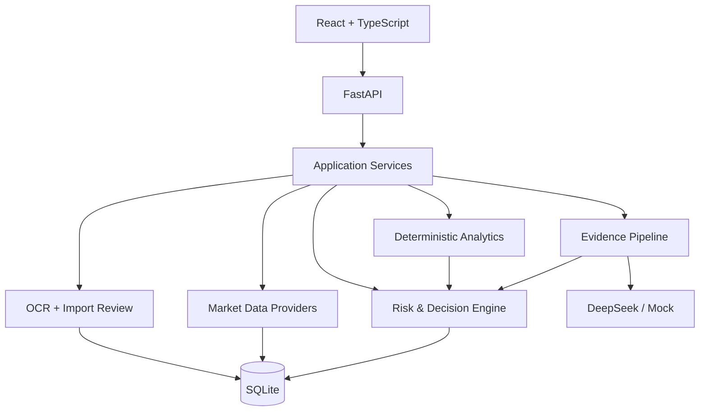

# v1 目标架构

## 1. 架构原则

- 本地优先，未来可部署。
- 前后端分离，但本地用户只需一个启动入口。
- 领域逻辑不依赖 UI、数据供应商或 LLM。
- 个人数据、公开市场数据和 AI 证据分离。
- 先确定性计算和规则门控，再允许 AI 解释。
- 所有外部结果可追溯、可缓存、可降级。
- 不为第一版引入微服务、Redis、消息队列、Kubernetes 或向量数据库。

## 2. 组件

## 3. 技术选择

| 层 | 第一阶段 | 未来部署 |
| --- | --- | --- |
| 前端 | React、TypeScript、Vite | 同一前端 |
| 后端 | FastAPI、Pydantic | FastAPI 多进程 |
| ORM/迁移 | SQLAlchemy、Alembic | 保持不变 |
| 数据库 | SQLite | PostgreSQL |
| OCR | RapidOCR、ONNX Runtime、OpenCV | 可替换独立 OCR Worker |
| 量化 | pandas、NumPy、SciPy | 保持不变 |
| 图表 | 前端图表库 | 保持不变 |
| AI | DeepSeek、Mock Provider | 增加供应商但保持统一协议 |
| 测试 | pytest、Vitest、Playwright | CI/CD 扩展 |

RapidOCR 的选择需要以支付宝截图回归集为准。如果识别或布局恢复不足，再比较 PaddleOCR-VL，而不是预先把重型模型加入主依赖。

## 4. 本地运行形态

开发阶段：

- 前端开发服务器负责热更新；
- FastAPI 提供 `/api/v1/*`；
- 只允许配置的本地来源访问 API。

发布阶段：

- 前端构建为静态资源；
- FastAPI 同时提供 API 与前端；
- Windows 启动脚本检查环境、数据库迁移和端口；
- 浏览器打开一个本地地址；
- 健康页面显示数据库、OCR、Provider 和 AI 状态。

## 5. 分层边界

### `domain`

基金、份额、净值、持仓、交易、候选、研究期限、指标、证据、建议和导入批次等稳定模型。不得导入 FastAPI、React、AKShare 或 DeepSeek SDK。

### `application`

组织用例：

- 创建候选；
- 刷新基金；
- 生成报告；
- 上传截图；
- 校对并确认导入；
- 计算组合；
- 生成操作建议；
- 检查触发条件。

### `providers`

负责把官方或聚合来源转换为领域模型。页面不得直接调用 AKShare/Tushare。

### `analytics`

收益、复权、回撤、波动、基准、相关性、XIRR、TWR、集中度和压力测试。

### `decision`

数据门控、产品适配、风险约束、市场状态、仓位区间和操作状态。不得依赖模型自然语言输出决定最终状态。

### `evidence`

获取、清洗、去重、可信度、发布时间、截止日期和 Evidence Pack。

### `ai`

结构化解释、反方观点、未知项和事件影响。模型无权访问个人截图、数据库、文件系统、网络工具或交易工具。

### `ocr`

图片哈希、版面检测、文本识别、页面分类、字段组合、置信度和草稿生成。

### `api`

请求校验、权限边界、错误响应和版本化 API。不得包含金融公式。

## 6. 数据库主题

v1 至少规划：

- `funds`
- `fund_aliases`
- `fund_nav`
- `benchmarks`
- `fund_holdings`
- `fund_managers`
- `market_snapshots`
- `candidate_funds`
- `portfolio_snapshots`
- `transactions`
- `import_batches`
- `import_images`
- `ocr_blocks`
- `import_drafts`
- `documents`
- `evidence_items`
- `ai_runs`
- `analysis_reports`
- `decision_runs`
- `trigger_rules`
- `data_quality_events`

正式 Schema 通过 Alembic 迁移管理，不再把所有建表 SQL 集中在一个不可演进文件。

## 7. API 约定

- 前缀：`/api/v1`。
- 错误使用稳定代码，不把 Python 堆栈直接返回前端。
- 写操作支持幂等键或内容哈希。
- 长任务返回任务状态，不让按钮无响应。
- 研究报告和建议包含 `as_of_date`、数据质量和版本。
- OCR 草稿与正式数据使用不同资源，确认前不能进入正式计算。
- OpenAPI Schema 生成前端类型或校验客户端契约。

## 8. 未来 C 端部署

部署前必须另行完成：

- 用户认证与会话；
- 租户隔离；
- 数据库和对象存储加密；
- 上传扫描与大小限制；
- HTTPS、密钥托管和审计；
- 备份、恢复和删除权；
- 后台任务和限流；
- 数据许可与合规复核；
- 明确投资研究辅助而非自动投顾的产品边界。

本地版不得仅加一个公网地址就宣称可以上线。

