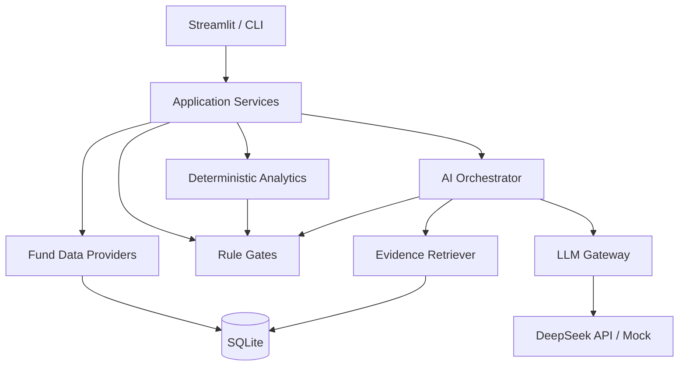

# 架构说明

## 分层

- `domain/`：稳定领域模型和协议，不依赖页面或供应商。
- `providers/`：AKShare 与本地 CSV 适配。上游字段变化只在这里处理。
- `analytics/`：收益、风险、回撤、XIRR 等确定性计算。
- `rules/`：数据门控和风险门控。AI 无权绕过。
- `documents/`、`retrieval/`：文档、证据单元和截止日期检索。
- `ai/`：DeepSeek/Mock 适配、Prompt、缓存、安全校验和调用编排。
- `storage/`：SQLite 模式与数据访问。
- `services/`：把以上模块组织成单基金和组合用例。
- `pages/`：只负责用户输入和展示。

## 为什么 AI 不直接读取网络或数据库

编排器先按分析对象和截止日期构造不可变 Evidence Pack，然后才发送给模型。这样可以：

- 防止模型引用未来信息；
- 防止外部文档中的 Prompt Injection 获得工具权限；
- 确保每条事件引用真实 `evidence_id`；
- 让 DeepSeek 不可用时确定性分析仍然运行；
- 保留完整审计记录。

## 扩展点

- 新数据源：实现 `FundDataProvider`，放入 `providers/`。
- 新模型：实现 `LLMProvider`，放入 `ai/providers/`。
- 新检索方式：实现与 `DatabaseRetriever` 相同的调用边界。
- 新基金类型：增加专属分析器和规则，不修改现有类型公式。
- 云端多用户：需要替换 SQLite、加入认证、加密、权限与审计，不能直接公开当前本地版。

