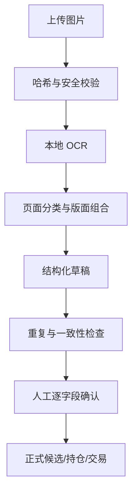

# 截图与个人数据导入规范

## 1. 目标与边界

截图导入用于建立用户自己的候选、持仓快照和交易流水，不用于替代基金公开资料。第一阶段只接收用户主动上传的图片，不登录支付宝、不读取 Cookie、不控制手机，也不自动执行交易。

DeepSeek 不直接接收图片。图片先由本地 OCR 和字段解析器转成结构化草稿，用户确认后才写入正式数据。

## 2. 支持的截图

| 页面 | 目标数据 | 典型字段 |
| --- | --- | --- |
| 基金自选 | 候选基金 | 名称、代码、份额类别、持有标记、截图日期 |
| 全部持有/资产构成 | 持仓快照 | 名称、金额、占比、持有收益、累计收益、总资产 |
| 收益明细 | 收益补充 | 日期、日收益、持有收益、累计收益 |
| 交易记录列表 | 交易草稿 | 类型、基金名称、金额或份额、发生时间、显示状态 |
| 单笔交易详情 | 精确交易补充 | 确认金额、确认份额、确认净值、费用、确认日期 |

列表截图能够恢复可见流水，但不一定包含确认份额、净值和费用。需要精确持仓成本或现金流收益率时，系统应要求补充单笔详情或人工录入，不得推算缺失字段冒充事实。

## 3. 导入流程

任何 OCR、分类或字段组合失败都进入可修订草稿，不得静默丢弃，也不得直接污染正式数据。

## 4. OCR 与版面恢复

首选实现：

- RapidOCR；
- ONNX Runtime；
- OpenCV 负责缩放、裁切、方向和必要的图像预处理；
- 确定性版面规则负责行、列、卡片和跨行名称组合。

OCR 引擎只负责文字与位置。基金代码、名称、金额和日期之间的归属由解析器根据页面模板、坐标关系和领域校验共同判断。

上传样例的可行性验证表明，基金名称、六位代码、金额、日期和百分比可以稳定识别；仍需处理以下问题：

- UI 已截断的名称无法由 OCR 恢复；
- 多张连续截图可能重叠；
- “金额”和“份额”不可混用；
- 交易列表不等于最终确认记录；
- 页面日期、交易日期和净值日期可能不同。

## 5. 草稿数据模型

每个导入批次至少保存：

- `batch_id`
- `import_kind`
- `created_at`
- `source_platform`
- `status`
- 图片数量、成功数和待处理数
- 解析器版本、OCR 版本

每张图片至少保存：

- 内容哈希和感知哈希；
- 文件尺寸、像素、方向；
- 截图显示时间（如可见）；
- 页面类型及置信度；
- OCR 原始块、坐标、置信度；
- 安全扫描和处理状态。

每个草稿字段至少保存：

- 原始文本；
- 标准化值；
- 字段置信度；
- 来源图片和 OCR 块；
- 校验问题；
- 用户修订前值与修订后值。

## 6. 字段校验

### 基金身份

- 代码必须为六位数字；
- 代码、正式名称和份额类别必须用公开数据核对；
- 同名不同份额不得合并；
- 截断名称只能作为候选匹配，不能直接确认身份；
- 匹配不唯一时必须由用户选择。

### 金额、份额和收益

- 保留币种和单位；
- 金额、份额、净值分别建模；
- 正负号与红绿颜色不能单独决定业务含义；
- 占比和总金额允许小范围四舍五入误差；
- 持有收益、累计收益和清仓收益不可混用。

### 日期

- 保存截图日期、下单时间、确认日期和净值日期；
- 未来日期、乱序日期和跨年边界必须提示；
- OCR 无法确认年份时不得自行补成年份；
- 用户设备时间异常时保留原始显示并标记。

## 7. 去重与合并

分三层去重：

1. 完全相同文件哈希：阻止重复导入；
2. 感知哈希与 OCR 区域相似：提示近似截图；
3. 业务记录键：检测多图重叠的同一候选、持仓行或交易。

交易业务键建议包含类型、基金身份、显示金额或份额、时间和平台状态。键相同但详情不同的记录进入冲突队列，不自动覆盖。

持仓截图默认生成“某一时点的快照”，不把两个日期的金额直接合并。候选截图以集合方式合并，但保留首次和最近出现时间。

## 8. 确认与回滚

导入状态：

- `uploaded`
- `processing`
- `needs_review`
- `confirmed`
- `partially_confirmed`
- `rejected`
- `failed`

只有 `confirmed` 的字段进入正式计算。用户确认后仍可通过新的修订记录更正，原始图片、OCR 值和修改历史保持可追溯。

正式数据写入必须在单个数据库事务中完成。失败时整个确认操作回滚，前端显示可重试错误。

## 9. 隐私与保留

- 默认在本机处理图片；
- 默认不把图片或 OCR 全文发送给 DeepSeek；
- 日志不得记录图片、完整交易流水或密钥；
- 原始图片是否长期保留由设置项控制，默认保留至用户确认后手动清理；
- 删除批次时明确区分“仅删原图”和“连同正式记录删除”；
- 未来多用户版必须使用独立对象存储、租户隔离和删除审计。

## 10. 验收样例

OCR 回归集必须使用脱敏图片，至少覆盖：

- 单张候选列表；
- 长名称和换行名称；
- 持仓金额、占比、收益；
- 买入、卖出、转换；
- 多张重叠交易列表；
- 截断名称；
- 低分辨率、深浅主题或压缩图片；
- 缺字段与冲突字段。

验收不只比较字符准确率，还要比较最终业务记录的字段准确率、重复率、需人工修订率和误写入率。正式数据误写入率必须为零。
