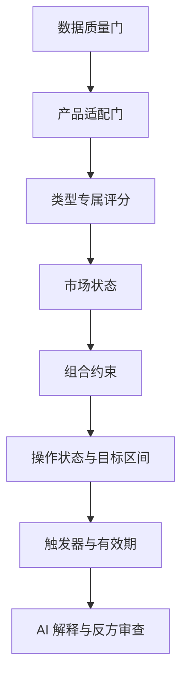

# 决策引擎规范

## 1. 基本原则

决策引擎生成研究辅助结论，不预测确定收益。最终操作状态必须由可复算指标、数据质量、产品适配、组合约束和规则门控产生；DeepSeek 负责解释和挑战结论，不直接改变数值或状态。

所有结果均包含：

- 适用基金与份额；
- 研究期限；
- 数据截止日期；
- 当前操作状态；
- 建议目标区间；
- 触发条件、持续时间和有效期；
- 正面证据、风险证据和反方观点；
- 未知项、失效条件和置信度；
- 使用的规则版本。

## 2. 两套研究期限

| 维度 | 2～3 个月 | 约 1 年 |
| --- | --- | --- |
| 核心问题 | 当前阶段是否值得暴露资金 | 中期逻辑能否持续并适合组合 |
| 主要信号 | 估值位置、趋势/波动、资金与事件、短期拥挤 | 基本面、基准逻辑、经理/持仓、估值周期 |
| 换手容忍 | 较高，但不支持高频 | 较低 |
| 建议有效期 | 默认 5～10 个交易日 | 默认 20～30 个交易日 |
| 复核事件 | 价格、波动、公告、政策快速变化 | 季报、经理、费率、指数规则、基本面变化 |
| 回撤参考 | 单仓阶段性约 10% | 实验组合阶段性约 10% |

两套期限分别计算，不把短期弱势自动解释为一年逻辑失效，也不以长期看好掩盖短期风险。

## 3. 决策流水线



### 3.1 数据质量门

检查：

- 基金身份和份额是否唯一；
- 净值、基准、费率、规模、经理和持仓是否足够；
- 数据是否过期、冲突或缺失；
- 个人持仓和交易是否已确认；
- 当前研究日期是否晚于资料可用日期。

关键字段不足时只能输出“数据不足”或“继续观察”。

### 3.2 产品适配门

检查：

- 产品类型是否属于 v1 完整评价范围；
- 申购、赎回、锁定期和持有期是否匹配；
- 风险等级和资产暴露是否与实验组合兼容；
- 是否存在清盘、暂停申赎、规模过小等硬风险；
- 是否与已有基金高度重复。

未支持类型显示“暂不支持完整评价”，可以提供事实摘要但不能给出强操作建议。

### 3.3 类型专属评价

指数、主动权益和债券基金分别使用 [产品需求](PRODUCT_REQUIREMENTS.md#6-基金类型差异) 中的指标。各指标必须保存输入、公式、输出和版本，禁止由 LLM 生成核心分数。

### 3.4 市场状态

市场状态由确定性特征组成，例如：

- 估值分位；
- 波动与回撤；
- 趋势和广度；
- 利率、信用利差或行业景气；
- 资金拥挤与重大事件；
- 数据置信度。

状态只允许在预设边界内调整目标区间，不能绕过风险上限或把未知数据当成利好。

## 4. 行业与主题权重

系统可以动态建议行业/主题比例，但不由 AI 自由分配。建议流程：

1. 识别基金穿透后的行业、风格和资产暴露；
2. 建立宽基/防御资产为核心的基础区间；
3. 根据市场状态对主题暴露做有上限的倾斜；
4. 约束单主题、相关主题合计和高波动资产；
5. 压力测试后缩减可能使组合超过回撤参考线的暴露；
6. DeepSeek 解释为何倾斜，并列出反例和失效条件。

第一版参数以配置文件和版本化规则保存。参数变更必须生成新的决策版本，不回写历史结论。

## 5. 操作状态

建议状态按强度有序：

| 状态 | 含义 |
| --- | --- |
| 数据不足 | 无法形成可靠评价 |
| 暂不支持完整评价 | 类型或数据超出 v1 能力 |
| 排除 | 硬性风险或明显不适配 |
| 继续观察 | 逻辑可研究，但当前条件不足 |
| 建仓候选 | 未持有且达到建仓门槛 |
| 小幅加仓候选 | 已持有、低于目标且条件满足 |
| 继续持有 | 处于目标区间且逻辑未失效 |
| 暂停加仓 | 可持有但不宜扩大暴露 |
| 减仓候选 | 超配或风险上升 |
| 退出复核 | 核心假设可能失效，需人工复核退出 |

系统输出的是“候选动作”，由用户最终决定。禁止使用“保证”“必涨”“一定卖出”等确定性措辞。

## 6. 目标区间

仓位以实验组合的百分比表示，优先给区间而非单点。计算至少考虑：

- 基金类型和基础风险预算；
- 单基金、单主题和相关暴露上限；
- 当前持仓与候选之间的重叠；
- 2～3 个月或约 1 年期限；
- 市场状态调整；
- 10% 回撤参考下的压力损失；
- 数据质量折扣。

系统不负责实验资金之外的现金配置。若建议区间无法满足约束，输出缩减后的可行区间或“暂不新增”，不得强行凑满 100%。

## 7. 数值触发器

触发器采用“指标 + 运算符 + 阈值 + 持续时间 + 冷却期 + 有效期”结构，例如：

```json
{
  "metric": "valuation_percentile",
  "operator": "<=",
  "threshold": 25,
  "for_trading_days": 3,
  "cooldown_days": 5,
  "valid_until": "2026-09-30",
  "proposed_state": "build_candidate"
}
```

支持的触发类别：

- 估值分位；
- 回撤和波动率；
- 相对基准表现；
- 组合实际权重；
- 相关性和主题合计暴露；
- 规模、费率、经理、指数规则或申赎状态变化；
- 官方公告和政策证据；
- 数据陈旧或来源冲突。

绝对单位净值不能单独触发“便宜买入”。

## 8. 回撤参考与压力测试

10% 是用户接受的阶段性风险参考，不是止损承诺或损失上限。系统至少提供：

- 历史最大回撤；
- 滚动区间最差表现；
- 组合相关性上升情景；
- 权益、主题、利率或信用冲击情景；
- 当前仓位下的估算组合损失；
- 超过参考线时的风险提示和降仓候选。

历史和压力结果不能证明未来不会超过 10%。流动性、申赎确认和隔夜跳变可能导致无法在阈值处成交。

## 9. AI 的职责

允许 DeepSeek：

- 总结 Evidence Pack；
- 解释确定性指标和规则结果；
- 提出反方观点；
- 标出证据冲突和未知项；
- 生成用户可读的条件说明。

禁止 DeepSeek：

- 读取原始截图；
- 生成或修改核心金融数字；
- 绕过规则输出操作状态；
- 自由决定行业百分比；
- 引用 Evidence Pack 外的当前事实；
- 触发交易。

AI 输出必须通过结构化 Schema 校验，并校验每个 `evidence_id`。失败时展示确定性报告和“AI 解释暂不可用”。

## 10. 回放与评估

每次决策保存输入快照、数据可用时间、规则版本、结果和 AI 解释。离线评估必须防止未来数据泄漏，并关注：

- 门控正确率；
- 触发器误触发率；
- 建议换手率；
- 超过回撤参考线的频率和幅度；
- 相对基准和简单策略的风险调整结果；
- 证据引用完整率；
- 历史建议是否可复现。

不能只用收益最高来选择规则。
